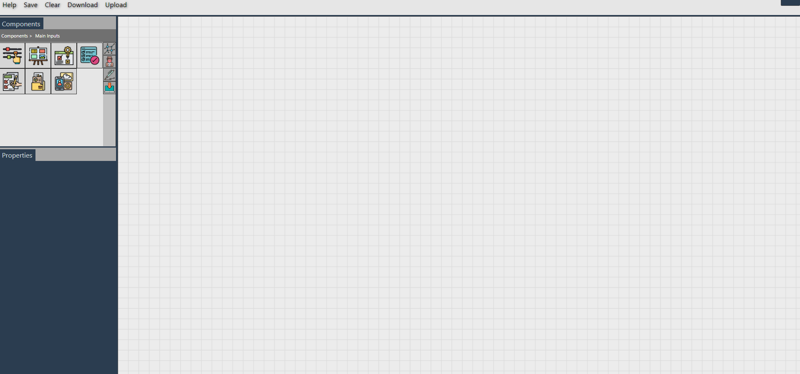
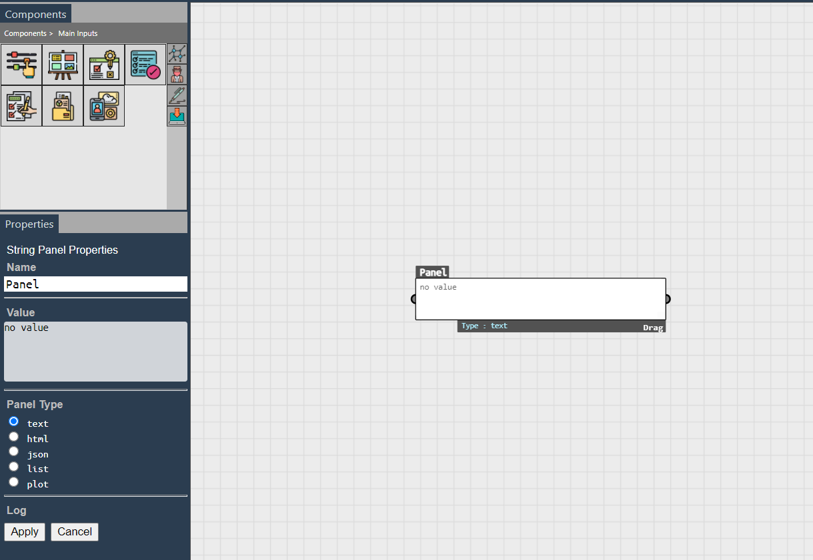
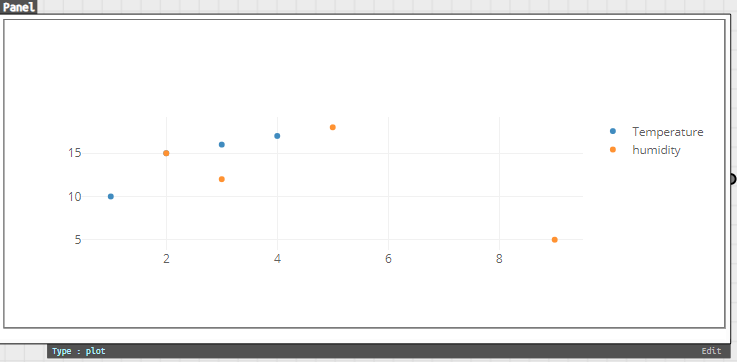
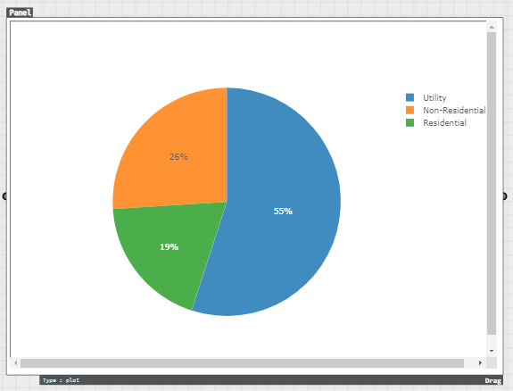
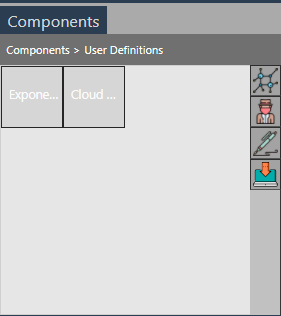

## Introduction

[](https://www.npmjs.com/package/data-viz)
[](https://opensource.org/licenses/MIT)

This is a React Component that serves as a fully fledged visual programming interface, ideal for simulation. <br>
It can additionally be customized to a certain degree with user-defined functions on top of the host of base components provided for general use cases.

Have a look at the tool in the [playground](./playground/) :)

---

## Table of Contents
* [Installation and Setup](#installation-and-setup)
* [Definitions](#definitions)
    * [Creating a new definition](#creating-a-new-definition)
    * [Saving a definition](#saving-a-definition)
    * [Clearing a definition](#clearing-a-definition)
    * [Downloading a definition](#downloading-a-definition)
    * [Opening a downloaded definition](#opening-a-downloaded-definition)
* [General Usage](#general-usage)
    * [Creating a new component](#creating-a-new-component)
    * [Setting inputs and outputs](#setting-inputs-and-outputs)
* [The Main Inputs](#the-main-inputs)
    * [Slider](#slider)
    * [Panel](#panel)
    * [Toggle](#toggle)
    * [Option List](#option-list)
    * [List View](#list-view)
    * [File Upload](#file-upload)
    * [Deep](#deep)
* [Shallow Components](#shallow-components)
* [Deep Components](#deep-components)
    * [Setting up a deep component](#setting-up-a-deep-component)
    * [Connecting to the cloud](#connecting-to-the-cloud)
    * [Connecting to local files](#connecting-to-local-files)
* [Creating Custom Components](#creating-custom-components)

---

## Installation and Setup

### For users with an existing React-based project

 - Use `npm` to install the package to the project

```md
npm install --save data-viz
```
 - Import `Canvas` into the relevant file

```md
import Canvas from 'data-viz';
```

### For users with no existing project

 - The simplest and fastest way to get started is to use `create-react-app` with which you can set up a boilerplate React application.

 - You’ll need to have [Node >= 10.16 and npm >= 5.6](https://nodejs.org/en/) on your machine. To create a project, run the following commands via terminal in a directory where you want the project to be :

```
npx create-react-app my-app
cd my-app
npm start
```
 - In case you run into issues at this stage, you can read more about Create React App and React in depth [here](https://reactjs.org/docs/create-a-new-react-app.html).

 - Use `npm` to install the package to the project. Run the following command within the `my-app` folder :

```
npm install --save data-viz
```
 - Render the Canvas in `my-app/src/App.js` as shown

``` jsx
import React from 'react'

import { Canvas } from 'data-viz';

function App() {
  return (
    <Canvas />
  );
}

export default App;

```
 - The localhost will automatically render the component on saving.


## Definitions

A definition refers to the current project workspace you have created on the canvas. It includes the state of the canvas (inputs, components, connections).

### Creating a new definition
 - Simply rendering the component gives you the ability to work on the canvas as you require. Jump to [General Usage](#general-usage) to learn how to use this tool.

### Saving a definition
 - Using the `Save` button in the Top Bar, you can save your current definition in your browser's local storage. This saved definition will be accessible on refresh and even on emptied cache and hard reload.

### Clearing a definition
 - Using the `Clear` button in the Top Bar, any saved definition in local storage will be permanently removed.

### Downloading a definition
 - Using the `Download` button in the Top Bar, the current definition can downloaded to your local computer as a `json` file.

### Opening a downloaded definition
 - Using the `Upload` button in the Top Bar, the definition can re-instated. The uploaded file must be a `json` file.
 - When a valid `json` file is uploaded, all the previous components and edges will be deleted.

---

## General Usage

#### The tool consists of 4 major sections:

 - The `Top Bar` gives you control over your definitions such as saving and clearing. The `Top Bar` can be hidden by clicking the button on the top right corner.
 - The `Components Tab` on the left holds all the in-house components as well as user-defined ones. Components are categorized, and the current category can be toggled through the column at the right edge of this tab.
 - The `Properties Tab` allows you to modify certain properties of select components, which can opened on double click of the specific component.
 - The `Canvas` is where your components will be added and input/output modified as required. The `Canvas` supports zoom while components support drag on the Canvas. 

<p align="center">

</p>

<p align="center">
A look at the rendered tool
</p>

### Creating a new component

A new component can be added onto the canvas by simply clicking on the relevant icon in the `Components Tab`. 
 - Hovering above component icons will identify each component with its name.
 - Double clicking selected components will open the `Properties Tab`. <br>
Note: Only `Slider`, `Panel`, `Option List` and `Deep` have the `Properties Tab`.

<p align="center">

</p>

<p align="center">
Canvas state after adding a Panel and double clicking it
</p>

### Setting inputs and outputs

 - Flow of data from component to component can be set by connecting them with edges.
 - Half circles on the left of a component represent the input and on the right represent the output.
 - An edge can be created by connecting these half circles.
 - Edges can be deleted by clicking the red circle at the middle of a drawn edge.

<p align="center">

</p>

<p align="center">
Slider output connected to a panel as input
</p>

---

## The Main Inputs

These are integral components that help with the input, selection and flow of data. They don't process input data according to a preset function like `Shallow` or `Deep` components.

### Slider
<p align="center">

</p>

<p align="center">
Slider Component and its Properties Tab
</p>

 - The `slider` allows a sliding numerical input useful for simulation purposes.
 - The `min`, `max`, `step` and `current value` can be set through the Properties Tab.
 - The `current value` of the slider can also be changed by dragging the anchor of the slider.

### Panel
<p align="center">

</p>

<p align="center">
Panel Component and its Properties Tab
</p>

 - The `panel` can be used to input a variety of types :
    - `text` - Accepts free user input as string
    - `html` - Renders the given html provided it is valid
    - `json` - Renders a visual tree view provided a valid object
    - `list` - Accepts a list of values
    - `plot` - Renders a plot of the given input. <br>
    The input follows this format: 

    ```js
    {"type": type, "data": [details]}
    ```
    where `type` refer to the type of the plot (bar, pie, scatter, etc) and `details` refers to the actual details of the panel.Refer the [Plotly site](https://plotly.com/javascript/) for formatting the `details` value.

    - Example 1: 

        - Input: 

        ```
        {"type": "scatter", "data": [{"x": [1, 2, 3, 4], "y": [10, 15, 16, 17], "mode":"markers", "name":"Temperature"}, {"x": [2, 3, 5, 9], "y": [15, 12, 18, 5], "mode":"markers", "name":"humidity"}]}
        ```

        - Output: 

        <p align="center">
        
        </p>

    - Example 2:
    
        - Input: 
        ```
        {"type":"pie","data":[{"values": [19,26,55], "labels": ["Residential","Non-Residential","Utility"], "type":"pie"}]}
        ```

        - Output:

        <p align="center">
        
        </p>

 - The `panel` can be resized to provide better visibility of the content of the panel to users.

### Toggle

 - The `toggle` provides a basic true/false input when connected.
 - The boolean value toggles on double clicking.

<p align="center">

</p>

<p align="center">
Toggle Component
</p>

### Option List
<p align="center">

</p>

<p align="center">
The Option List Component and its Properties Tab
</p>

- The `option list` provides a dropdown of options of which one can be selected.
- The dropdown can be specified as a list in a `panel` and connected to the `option list` input.

### List View
<p align="center">

</p>

<p align="center">
The List View Component
</p>

- The `list view` functions similar to the `option list` but it allows multiple option selection and is rendered as a json tree view by default.

### File Upload
<p align="center">

</p>

<p align="center">
The File Upload Component
</p>

 - The `file upload` component allows local files to be uploaded.
 - Uploaded files will saved in local storage until the project definition is cleared.

### Deep
<p align="center">

</p>

<p align="center">
The Deep Component and its Properties Tab
</p>

 - The `deep` component is used when the function that is to be to run is either in the cloud or located as a local file accessible via the project backend. 
    - `input list` - Takes in the name of each input separated by a newline
    - `url`        - The url to which the GET request is routed to
 - More about setting up and usage at [Deep Components](#deep-components).

---

## Shallow Components

Shallow components refer to functions that will be run in real-time when inputs are provided.

<p align="center">

</p>

<p align="center">
The Average Component in use
</p>

<br>

Provided component | Usage
-------------------------|-------------------------
 Average   |   Calculate the average of an input list of numbers
 Add   |   Calculate the sum of an input list of numbers
 Min   |   Calculate the minimum of an input list of numbers
 Max   |   Calculate the maximum of an input list of numbers
 Difference 2 |   Calculate the difference between 2 numbers
 JSON Navigator   |   Traverse a JSON according to a given path
 3D Visualizer   |   Visualize a relevant 3D object in iframe given a valid url
 Image Display   |   Visualize an image given a valid link
 YouTube Display   |   Watch an embedded YouTube video given a valid link
 Plot Panel   |   Plot the provided data given valid formatting
 String to List | Converts a string-like list to a list
 Replace | Replaces all occurences of a string in a text with a new one


---

## Deep Components

Deep Components run functions by sending GET requests to the provided url, which in turn would process the given input parameters and return the result. 
After connecting all the inputs and outputs to a deep component, users need to click the `Play` button to start the asynchronous request and set the value to the output components.

### Setting up a deep component

 - Add the `Deep` component from the `Main Inputs`, and open its `Properties Tab`.
 - Set the name of each input parameter separated by a newline, and the url.
 - The component will render the input/output circles at this point, along with a run button.
 - Run the function after connecting inputs/outputs.
 - The asynchronous request will be processed and the result/error set to the output.

<p align="center">

</p>

<p align="center">
The Deep Component after setting inputs and url
</p>

### Connecting to the cloud

 - A cloud function can be defined on any available platform such as Google Cloud Platform.
 - Ensure your function is public.
 - Handle preflight requests as shown below and detailed [here](https://cloud.google.com/functions/docs/writing/http#functions_http_cors-nodejs).
 - The GET request sends the parameters as `p1`, `p2` ... `pn`. Therefore, request querying should be handled as such.

<p align="center">

</p>

<p align="center">
A Google Cloud Function using node.js runtime
</p>

### Connecting to local files

 - This is useful when there are scripts in your local machine written in other languages like `python`.
 - A server is required to achieve this, so projects which already have a server/backend can use that, while other projects will need to incorporate one.
 - `express` is relatively easy to set up for a server and we will use the `child_process` node module to spawn new processes to run the external scripts.

```
npm install --save express
npm install --save child_process
```

 - Add a defined proxy for requests to get routed to, inside `package.json`.

```
"proxy": "http://localhost:8080",
```

 - Create a new `server.js` file rooted at `my-app`. A template that can be followed is provided at [server.js](./server.html).
    - To prevent CORS issues, ensure it is configured as shown in `server.js`.
    - The template has set up a `/python` route that will run a python file given a valid filepath and any arguments necessary. Anything printed to stdout will be displayed.
    - The provided `/bat` and `/r` routes allows such files to be executed.
    - The GET request sends the parameters as `p1`, `p2` ... `pn`. Therefore, request querying should be handled as such.
    - Additional routes can be added as necessary to run other files/functions as required.
 - Run the server simultaneously with `npm start` in a separate terminal.

```
node server.js
```

 - Use `http://localhost:8080/{route}` as the url for the `Deep` compoonent.


---

## Creating Custom Components

Besides using pre-defined components, you can add new components to the tool by passing the required information of all the components you want to include as an array of JSON objects as  `props` of the `Canvas`.

### The Component JSON

#### Required Parameters

- `name` : Name of the new component
- `type` : Allowed type values -> [`component`, `optionList`, `string`, `deep`]
- `dftype` : Allowed dataflow values -> [`shlow`, `dp`]
- `inputList` : A list of dictionary for each input, each with attributes `name`, `shortName`, `desc`, `default_value`
- `outputList` : A list of dictionary for each output, each with attributes `name`, `shortName`, `desc`, `default_value`
- `name`: Attribute required for each entry in `inputList`, `outputList`

 - Shallow functions (type != `deep`, dftype = `shlow`)

    - `func` : The function that is executed when the component is connected to an input. 
    - The return should be a `json` of 2 lists, `type` and `value`.
    - The length of both lists should tally with the number of outputs in `outputList`. 
    - The `type` list gives the type of the corresponding entry in the `value` list, and allowed type values are <br> [`text`, `html`, `json`, `list`, `plot`]

```js
{
  type:  [],
  value: []
}
```

<p align="center">
Format of function return value
</p>

 - Deep functions (type = `deep`, dftype = `dp`)

    - `url` : URL of the deep function

#### Optional Parameters

- `shname` : Short name
- `desc` : Description
- `color` : Color (in hex)
- `backgroundImage` : URL to the image

To use these new components, pass it as the `udo` property to the `Canvas` component as follows, where `newComps` is the array of JSON objects.

```jsx
    <Canvas udo={newComps} />
```

 - Refer [App.js](./app.html) to see how two components called `Exponential` and `Cloud - Absolute` are added to the tool.

 - Refer [stockComponents](./stockComponents.html) for details of additional, more specific, components. 

 - The new components will be found in the `User Definitions` tab of the `Left Container`.

<p align="center">

</p>

<p align="center">
New user-defined components
</p>